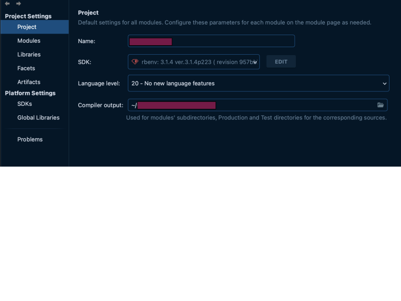
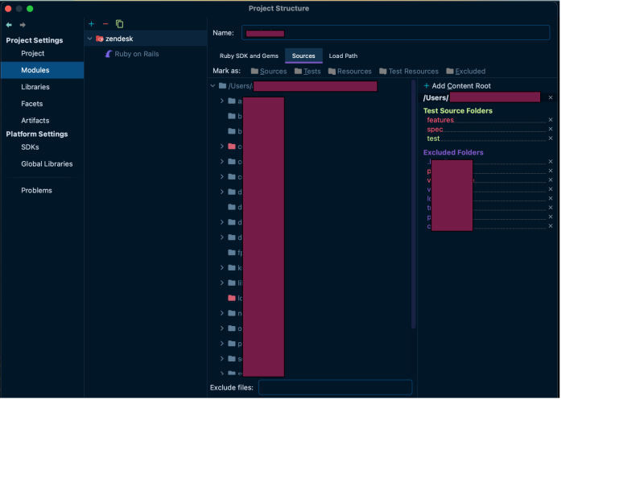
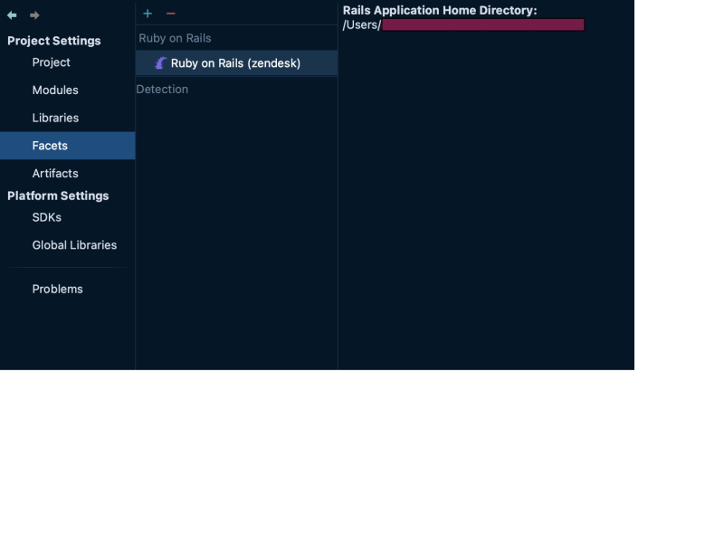
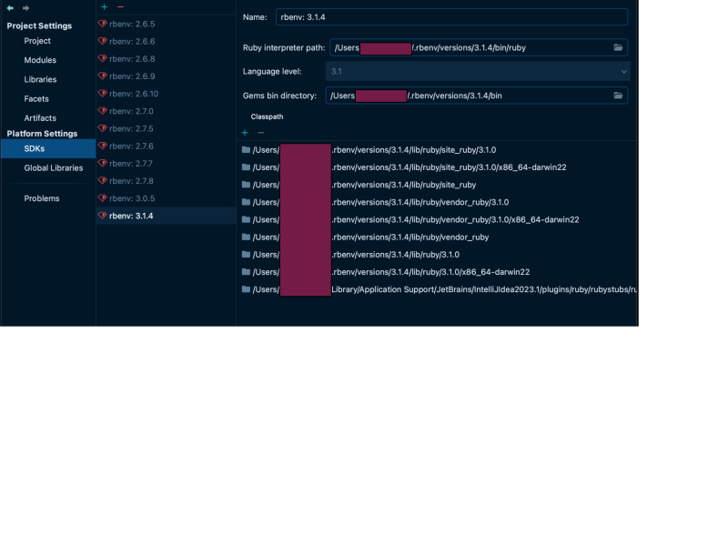
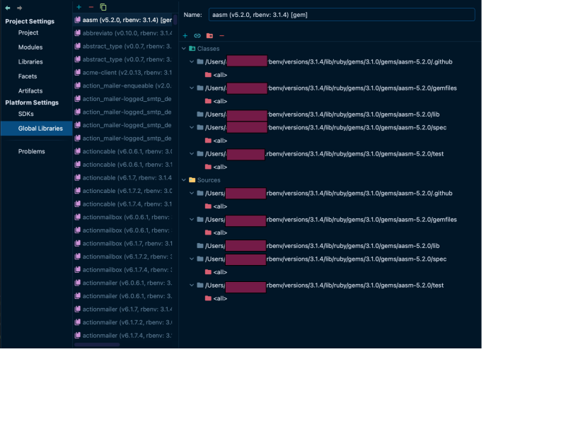
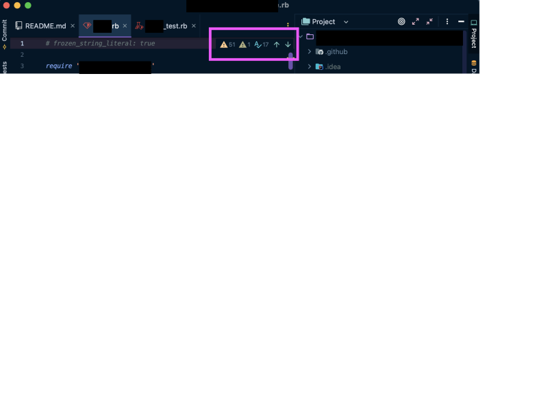
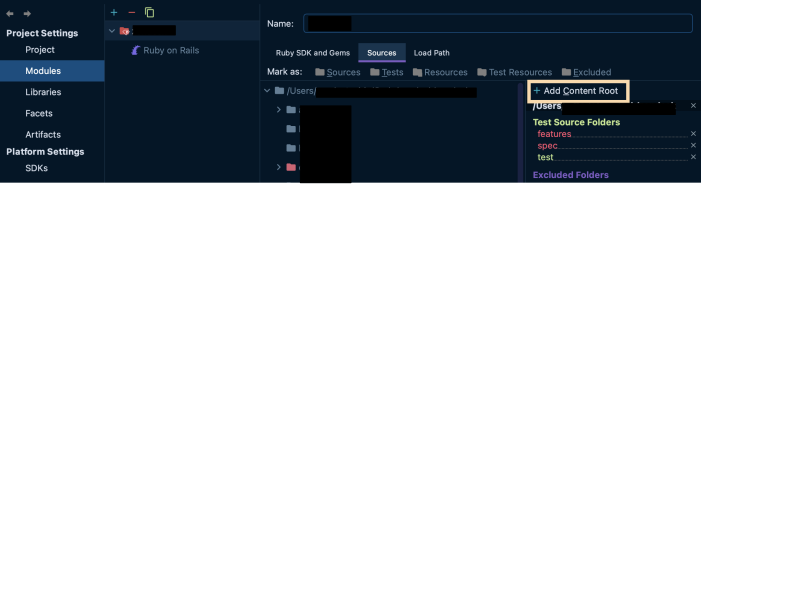
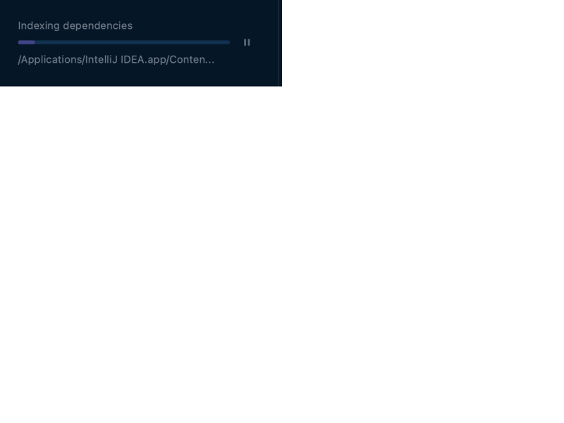

This is a guide I wrote to set up IntelliJ Idea to work with my former employer's Ruby on Rails codebase. All sensitive information and details are edited from both images and text.

<!-- truncate -->

---

## 🧭 Getting started

If you are completely new to IntelliJ, there are some docs that will help you get started:

- [How to open/import/export a project](https://www.jetbrains.com/help/idea/import-project-or-module-wizard.html)
- [How to create a CLI launcher](https://medium.com/@shaunthomas999/how-to-launch-intellij-idea-from-command-line-ba10443cc1a9)
- [How to install a Rubproy plugin to develop with Ruby](https://www.jetbrains.com/help/idea/ruby-plugin.html)

## ⚙️ Project structure config
This is the sample config for `<zendesk_codebase>` that works, as of August 2023.

### Project

### Modules

### Libraries and Artifacts

Ok to leave both empty.

### Facets

### SDKs

### Global Libraries

## 🔴 Errors

Most likely you will see a lot of errors, warnings and squiggly lines in your editor:

The IntelliJ analyzer is a bit too thorough for the dynamically typed Ruby, so it’s okay to silence either all of them, or everything except Syntax errors.

## 🛠️ Troubleshooting

### 😱 Source root is not configured

In this case IntelliJ will either be yelling at you with an error, or you will not see the correct files and folders in your project (app, test, lib, etc etc.)

In this case you need to go to Modules and add the content root here:

Navigate into the `<zendesk_codebase>` directory on your machine, and click “Open”.

When the root is configured correctly, you will see all the correct files and directories in your project.

### 😱 Ruby Interpreter is not configured

In this case your IntelliJ might not recognize your project as Ruby. You need to go to the Project Structure settings and set up all the correct modules and SDKs. Set everything up like in the example project structure above ⬆️.

If you did, and your IntelliJ still thinks you are programming in something else (the indicator of this would be if your files and folders don’t have Ruby specific icons). Then, you will need to remove your module and import it again, like they explain here.

### 😱 Can not save project structure settings

This is the case when you have made changes to the project structure settings, and then trying to click “ok” or “apply”, but nothing is happening, and there are no visible errors.

The reason for this is likely that IntelliJ is indexing the project or working something else in the background. In the older versions of Idea you might see the progress bar at the bottom of the editor screen. In newer versions UI you might see a pop up somewhere like this one: 

... or you might not see anything at all.

The solution might be to either:

- Wait for a few minutes and then close and reopen Project Structure. When you reopen it, you may see that the settings are already applied, like so:
<!--  -->

- If the above doesn’t help and the settings reset, then try the radical way of removing your config and starting again:
	- shut down IntelliJ
	- remove the `.idea` folder from your project 
	- reopen your project in IntelliJ

	In this case you might see that your settings are magically fixed.

