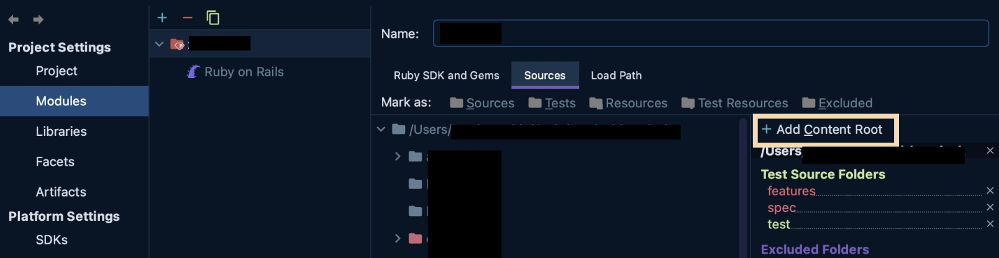

This is an internal guide I wrote at my former workplace for developers or any other IDE users on how to set up IntelliJ Idea to work with our Ruby on Rails codebase. All sensitive information and details are edited from both images and text.

<!-- truncate -->

---

## 🧭 Getting started

If you are completely new to IntelliJ, here are links to some docs that will help you get started:

- [How to open/import/export a project](https://www.jetbrains.com/help/idea/import-project-or-module-wizard.html)
- [How to create a CLI launcher](https://medium.com/@shaunthomas999/how-to-launch-intellij-idea-from-command-line-ba10443cc1a9)
- [How to install a Ruby plugin to develop with Ruby](https://www.jetbrains.com/help/idea/ruby-plugin.html)

## ⚙️ Project structure config
This is the sample config for `<cool_codebase>` that works as of August 2025.

### Project

### Modules

### Libraries and Artifacts

It's ok to leave both empty.

### Facets

### SDKs

### Global Libraries

## 🔴 Errors

Most likely you will see a lot of errors, warnings and squiggly lines in your editor:

The IntelliJ analyzer is a bit too thorough for the dynamically typed Ruby, so it’s okay to silence either all of them, or everything except syntax errors.

## 🛠️ Troubleshooting

### 😱 Source root is not configured

In this case IntelliJ will either be yelling at you with an error, or you will not see the correct files and folders in your project (app, test, lib, etc.)

To fix this, you need to go to the Modules settings tab and add the content root here:

Navigate into the `<a_codebase>` directory on your machine and click “Open”.

When the root is configured, you will see all the correct files and directories in your project.

### 😱 Ruby Interpreter is not configured

This may mean that IntelliJ does not recognize your project as a Ruby project. Go to the Project Structure settings and set up all the correct modules and SDKs. Refer to the [example project structure](#️-project-structure-config) above.

If you did, and IntelliJ still thinks you are programming in something else (the indicator would be that your files and folders don’t have Ruby-specific icons), try:
- going to the Modules tab,
- removing any modules you see there, including the Ruby module,
- importing Ruby module again.

See [this post on the IntelliJ support forum](https://intellij-support.jetbrains.com/hc/en-us/community/posts/11908570966546/comments/12048520432658) for reference.

### 😱 Can not save project structure settings

If you make changes to the project structure settings, and clicking "ok" or "apply" doesn't do anything, it's likely because IntelliJ is indexing the project or doing something else in the background. In the older versions of Idea you might see the progress bar at the bottom of the editor screen. In the newer versions' UI you might see a pop-up somewhere like this one:

... or you might not see anything at all, just the view that appears stuck.

If this is happening, here are some things to try:

- Wait for a few minutes and then close and reopen Project Structure. When you reopen it, you may see that the settings are already applied.

- Reset your config and start over:
	- shut down IntelliJ
	- remove the `.idea` folder from your project
	- reopen your project in IntelliJ

	This is a bit radical and counter-intuitive, but can help apply your intended settings.

